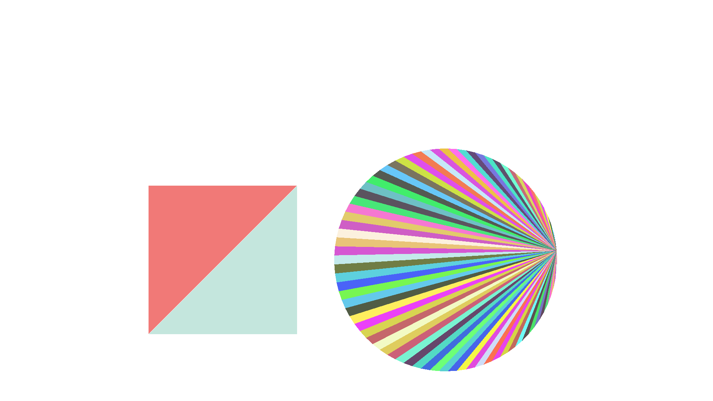

# vectorg

Me learning how triangulation and tessellation work, in C.

Builds shapes from path commands, flattens them into polygon contours,
triangulates with ear clipping, and rasterizes the triangles into a PNG.

## Build & run

```sh
make
./vectorg out.png
```


